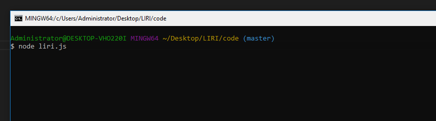
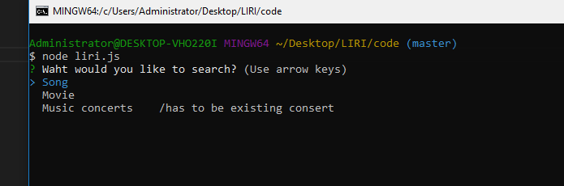
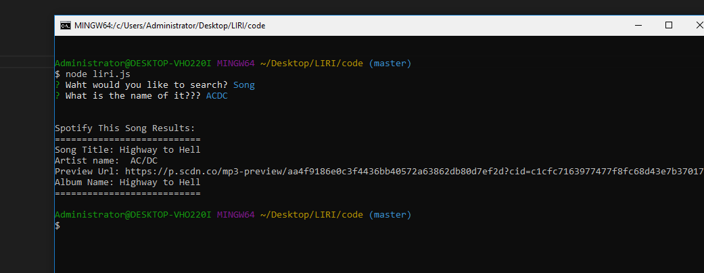

# Liri-  a node application.

To install all necessary npm packages run these commands in lir derectory:
* npm install 

## You will need to crate a file .env to store the API keys

* SPOTIFY_ID = c1cfc7163977477f8fc68d43e7b37017
* SPOTIFY_SECRET = 46a8bafb53774805a8cd6d7d695853aa

* BANDS_APP = 21efbfd1101fb06a92b91cd0eb7f48d7

## API has beenused it this project
* BandInTown: http://www.artists.bandsintown.com/bandsintown-api

* Spotify: https://developer.spotify.com/my-applications/

* OMDb API: http://www.omdbapi.com/apikey.aspx

to run the file type node liri.js

then choose one of the options 

and get result

